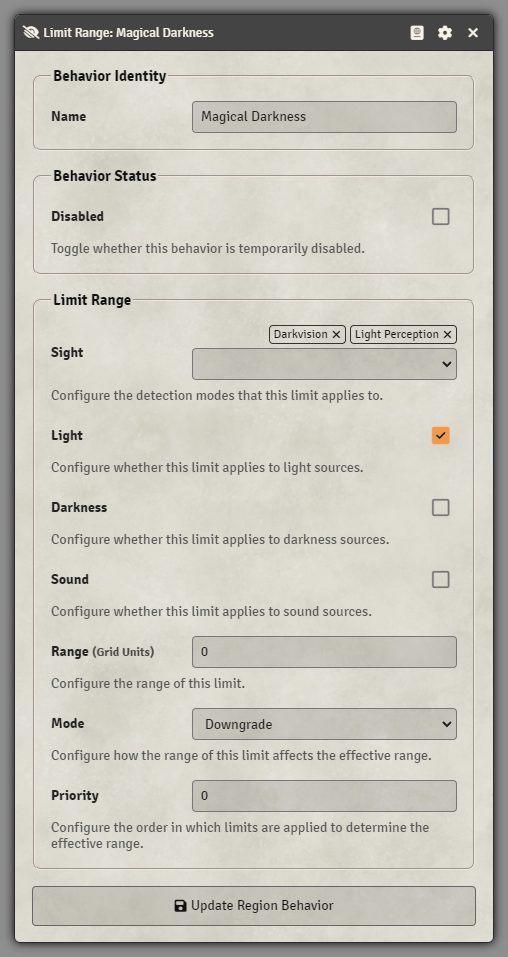

[](https://github.com/dev7355608/limits/releases/latest)

[](https://forge-vtt.com/bazaar#package=limits)
[](LICENSE)

# Limits (Foundry VTT Module)

This module allows you to define the maximum range of light, sight, and sound within the scene, drawings, templates, and tiles.



```js
object.document.setFlag("limits", {
  light: {
    enabled: true,
    range: 0,
  },
  sight: {
    basicSight: {
      enabled: true,
      range: 0,
    },
    seeAll: {
      enabled: true,
      range: 30,
    },
    // ...
  },
  sound: {
    enabled: false,
    range: null, // Infinity
  },
});
```

## Macros

### D&D 5e

Recommended modules:

- [Vision 5e](https://foundryvtt.com/packages/vision-5e)
- [Walled Templates](https://foundryvtt.com/packages/walledtemplates)

#### Darkness spell

```js
// === Darkness spell template ===

if (!game.modules.get("limits")?.active) {
  ui.notifications.warn("The Limits module is not enabled!");
}

const templateData = {
  t: CONST.MEASURED_TEMPLATE_TYPES.CIRCLE,
  distance: 15,
  fillColor: "#000000",
  flags: {
    limits: {
      // Block sight-based senses except for Devil's Sight and Truesight
      sight: {
        basicSight: { enabled: true, range: 0 }, // Darkvision
        ghostlyGaze: { enabled: true, range: 0 }, // Ghostly Gaze (Vision 5e)
        lightPerception: { enabled: true, range: 0 }, // Light Perception (Vision 5e)
      },
      // Block light
      light: { enabled: true, range: 0 },
    },
  },
};

// Walled Templates (optional)
if (game.modules.get("walledtemplates")?.active) {
  templateData.flags.walledtemplates = {
    wallsBlock: "recurse", // blocked by walls and spreads around corners
    wallRestriction: "move",
  };
}

const template = (
  await new dnd5e.canvas.AbilityTemplate(
    new CONFIG.MeasuredTemplate.documentClass(templateData, {
      parent: canvas.scene,
    })
  ).drawPreview()
).at(0);

// Sequencer + JB2A Assets (optional)
if (
  game.modules.get("sequencer")?.active &&
  (game.modules.get("JB2A_DnD5e")?.active ||
    game.modules.get("jb2a_patreon")?.active)
) {
  new Sequence()
    .effect()
    .persist(true)
    .file("jb2a.darkness.black")
    .opacity(0.5)
    .attachTo(template)
    .scaleToObject((template.distance + 2.5) / template.distance)
    .xray(true)
    .aboveLighting()
    .mask(game.modules.get("walledtemplates")?.active ? [template] : [])
    .play();
}
```

#### Hunger of Hadar spell

```js
// === Hunger of Hadar spell template ===

if (!game.modules.get("limits")?.active) {
  ui.notifications.warn("The Limits module is not enabled!");
}

const templateData = {
  t: CONST.MEASURED_TEMPLATE_TYPES.CIRCLE,
  distance: 20,
  fillColor: "#000000",
  flags: {
    limits: {
      // Block sight-based senses
      sight: {
        basicSight: { enabled: true, range: 0 }, // Darkvision
        devilsSight: { enabled: true, range: 0 }, // Devil's Sight (Vision 5e)
        ghostlyGaze: { enabled: true, range: 0 }, // Ghostly Gaze (Vision 5e)
        lightPerception: { enabled: true, range: 0 }, // Light Perception (Vision 5e)
        seeAll: { enabled: true, range: 0 }, // Truesight
      },
      // Block light
      light: { enabled: true, range: 0 },
    },
  },
};

// Walled Templates (optional)
if (game.modules.get("walledtemplates")?.active) {
  templateData.flags.walledtemplates = {
    wallsBlock: "walled", // blocked by walls and does not spread around corners
    wallRestriction: "move",
  };
}

const template = (
  await new dnd5e.canvas.AbilityTemplate(
    new CONFIG.MeasuredTemplate.documentClass(templateData, {
      parent: canvas.scene,
    })
  ).drawPreview()
).at(0);

// Sequencer + JB2A Assets (optional)
if (
  game.modules.get("sequencer")?.active &&
  (game.modules.get("JB2A_DnD5e")?.active ||
    game.modules.get("jb2a_patreon")?.active)
) {
  new Sequence()
    .effect()
    .persist(true)
    .file("jb2a.darkness.black")
    .opacity(0.5)
    .attachTo(template)
    .scaleToObject((template.distance + 2.5) / template.distance)
    .xray(true)
    .aboveLighting()
    .mask(game.modules.get("walledtemplates")?.active ? [template] : [])
    .zIndex(0)
    .effect()
    .persist(true)
    .file("jb2a.arms_of_hadar.dark_purple")
    .opacity(0.5)
    .attachTo(template)
    .scaleToObject((template.distance + 2.5) / template.distance)
    .xray(true)
    .aboveLighting()
    .mask(game.modules.get("walledtemplates")?.active ? [template] : [])
    .zIndex(1)
    .play();
}
```

#### Fog Cloud spell

```js
// === Fog Cloud Spell Template ===

if (!game.modules.get("limits")?.active) {
  ui.notifications.warn("The Limits module is not enabled!");
}

const spellLevel = 1;
const templateData = {
  t: CONST.MEASURED_TEMPLATE_TYPES.CIRCLE,
  distance: 20 * spellLevel,
  fillColor: "#ffffff",
  flags: {
    limits: {
      // Block sight-based senses
      sight: {
        basicSight: { enabled: true, range: 0 }, // Darkvision
        devilsSight: { enabled: true, range: 0 }, // Devil's Sight (Vision 5e)
        ghostlyGaze: { enabled: true, range: 0 }, // Ghostly Gaze (Vision 5e)
        lightPerception: { enabled: true, range: 0 }, // Light Perception (Vision 5e)
        seeAll: { enabled: true, range: 0 }, // Truesight
      },
    },
  },
};

// Walled Templates (optional)
if (game.modules.get("walledtemplates")?.active) {
  templateData.flags.walledtemplates = {
    wallsBlock: "recurse", // blocked by walls and spreads around corners
    wallRestriction: "move",
  };
}

const template = (
  await new dnd5e.canvas.AbilityTemplate(
    new CONFIG.MeasuredTemplate.documentClass(templateData, {
      parent: canvas.scene,
    })
  ).drawPreview()
).at(0);

// Sequencer + JB2A Assets (optional)
if (
  game.modules.get("sequencer")?.active &&
  (game.modules.get("JB2A_DnD5e")?.active ||
    game.modules.get("jb2a_patreon")?.active)
) {
  new Sequence()
    .effect()
    .persist(true)
    .file("jb2a.fog_cloud.01.white")
    .opacity(0.5)
    .attachTo(template)
    .scaleToObject((template.distance + 2.5) / template.distance)
    .xray(true)
    .aboveLighting()
    .mask(game.modules.get("walledtemplates")?.active ? [template] : [])
    .play();
}
```

#### Silence spell

```js
// === Silence spell template ===

if (!game.modules.get("limits")?.active) {
  ui.notifications.warn("The Limits module is not enabled!");
}

const templateData = {
  t: CONST.MEASURED_TEMPLATE_TYPES.CIRCLE,
  distance: 20,
  fillColor: "#7fffff",
  flags: {
    limits: {
      // Block hearing
      sight: {
        hearing: { enabled: true, range: 0 }, // Hearing (Vision 5e)
      },
      // Block sound
      sound: { enabled: true, range: 0 },
    },
  },
};

// Walled Templates (optional)
if (game.modules.get("walledtemplates")?.active) {
  templateData.flags.walledtemplates = {
    wallsBlock: "walled", // blocked by walls and does not spread around corners
    wallRestriction: "move",
  };
}

const template = (
  await new dnd5e.canvas.AbilityTemplate(
    new CONFIG.MeasuredTemplate.documentClass(templateData, {
      parent: canvas.scene,
    })
  ).drawPreview()
).at(0);

// Sequencer + JB2A Assets (optional)
if (
  game.modules.get("sequencer")?.active &&
  (game.modules.get("JB2A_DnD5e")?.active ||
    game.modules.get("jb2a_patreon")?.active)
) {
  new Sequence()
    .effect()
    .persist(true)
    .file("jb2a.energy_field.02.below.blue")
    .opacity(0.25)
    .attachTo(template)
    .scaleToObject((template.distance + 2.5) / template.distance)
    .xray(true)
    .aboveLighting()
    .mask(game.modules.get("walledtemplates")?.active ? [template] : [])
    .zIndex(0)
    .effect()
    .persist(true)
    .file("jb2a.energy_field.02.above.blue")
    .opacity(0.25)
    .attachTo(template)
    .scaleToObject((template.distance + 2.5) / template.distance)
    .xray(true)
    .aboveLighting()
    .mask(game.modules.get("walledtemplates")?.active ? [template] : [])
    .zIndex(1)
    .play();
}
```
